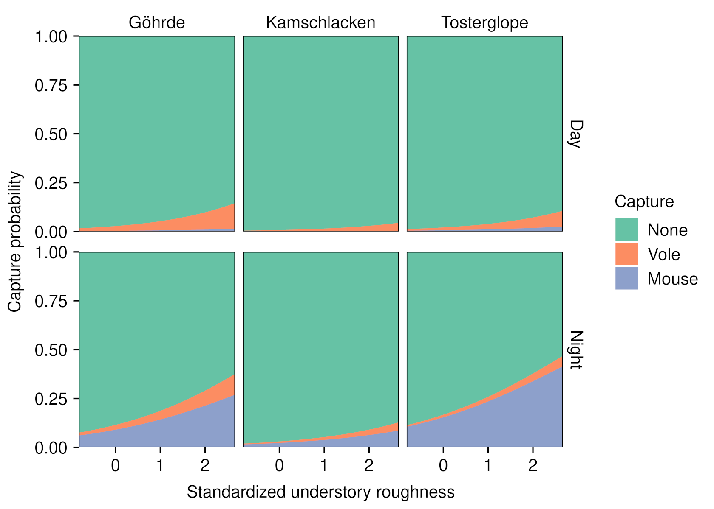

## Linking small mammal capture probability with understory structural complexity using mobile laser scanning-derived metrics: a case study

Ieva Bebre, Scott Appleby, Hannes Riebl, Dominik Seidel

**This repository contains the data and code for the paper.**

### Abstract

Vegetation cover, downed branches, and lying deadwood provide small mammals with food, shelter, and nesting sites. These elements create understory structural complexity, which is important in habitat selection. Mobile laser scanning (MLS) is a relatively novel technology that allows reconstruction of the forest understory's key structural parameters. We explored the use of MLS to assess fine-scale habitat preferences, using the wood mouse, yellow-necked mouse, and bank vole as representative species. We combined small mammal surveys with laser scanning, assessed small mammal density and capture probability in relation to a holistic MLS-derived understory complexity measure, and compared its effectiveness with the explanatory power of vegetation cover. We found a positive relationship between small mammal density and higher understory structural complexity for both voles and mice. We also found the same positive relationship between capture probability and understory complexity. Our results suggest that MLS is a promising technology for measuring understory complexity and investigating habitat preferences of small mammals that could be expanded for other species groups and, in the context of this study, is superior to field vegetation surveys.

### Illustration

Stacked predicted probabilities of capturing a mouse, a vole, or nothing (none) depending on the standardized understory roughness, site, and time of day, obtained using a multinomial logistic regression model. For all other explanatory variables, the average values over the whole dataset were used.
